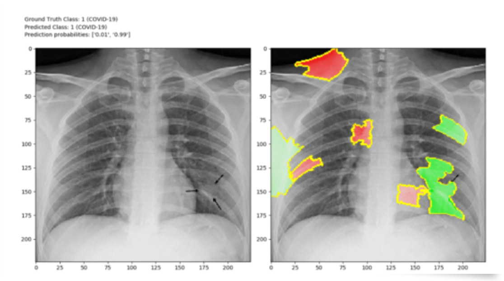
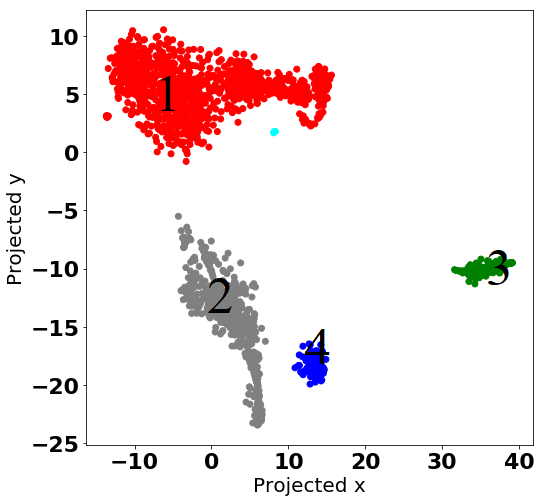
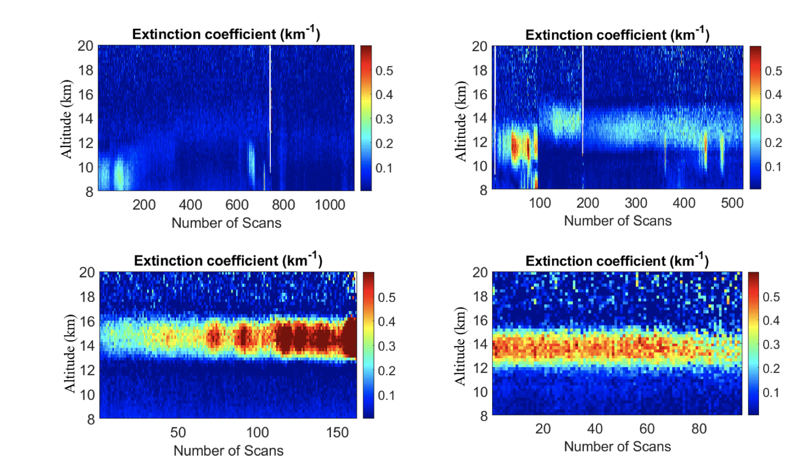
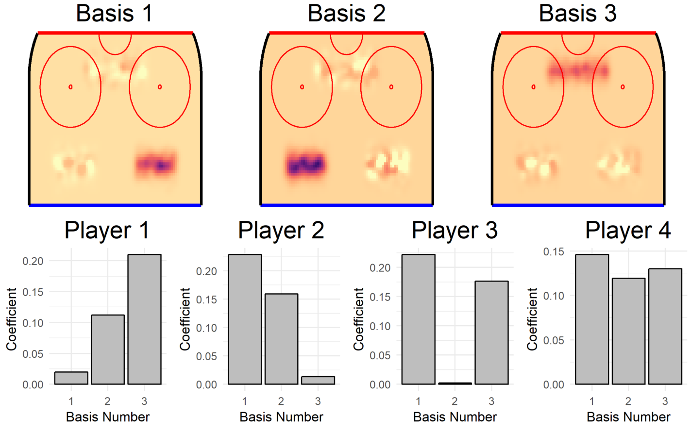
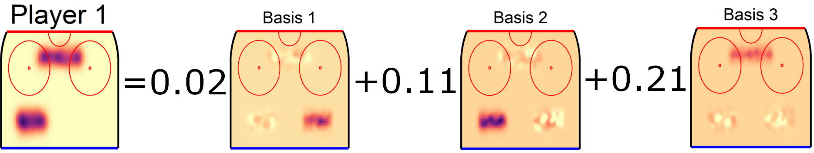
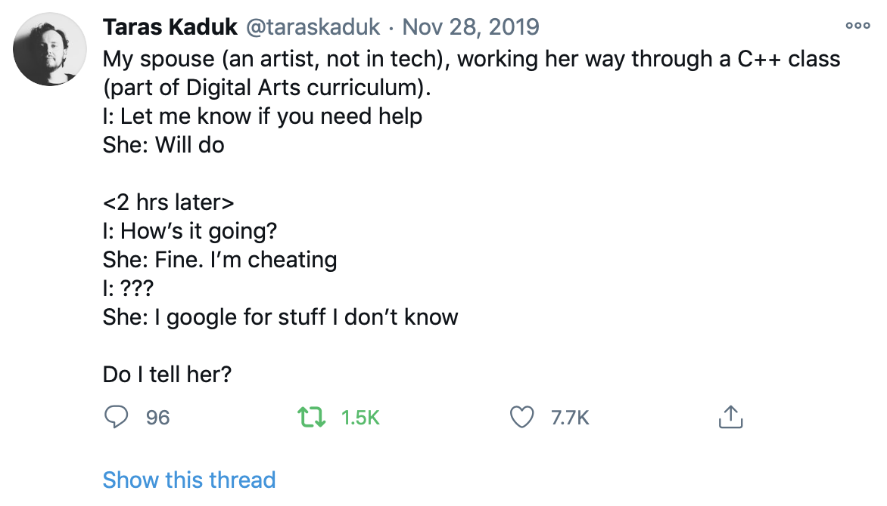

<!---
Github will automatically render these, so it will be good for notes. Attendees don't need to download anything to view the notes.

After creating this, it occurs to me that ipynb might be easier for our purposes.

Note: Pandoc can convert this to html, pdf, docx, pptx, etc.
--->

# Lesson One Learning Outcomes

- [ ] Have a very general understanding of Data Science (DS)
- [ ] Identify where DS and Machine Learning (ML) overlap (and how they're different)
- [ ] See some examples of DS and ML in action
- [ ] Get acquainted with DS and ML tools
- [ ] Become inspired to use DS and ML in your own research

# What is Data Science?

- Statistics?
- Computer science?
- Linear Algebra?
- Information Organization Systems? 
- Substantive Expertise?
- Magic?

Answer to all: Yes.

# Examples of Machine Learning in Everyday Life

- Sentiment analysis - let a computer decide if a word is positive or negative
    - Does one twitter user have more positive tweets than another?
- Image recognition - what's in this picture?
    - Does an xray contain evidence of COVID-19?
- Recommendation algorithms - if people like these things, what else would they like?
    - What music will you play next?
    - What tv show would you enjoy on a streaming service?
    - What products will you buy next?
    - What stocks do similar investors buy?
- [Electoral predictions](https://www.nytimes.com/elections/2016/forecast/president)
    - Which candidate is most likely to win a race?
    - How can we account for uncertainty in human behaviour?

# Examples From Academic Research

Ghazal, Devan, and Alexis come from different disciplines but they all use ML in their research. 

# Ghazal - Physics
Ghazal explained her work in the following video (Just click on the picture to get into the video!)

Lidar Data Clustering: Exploring traces of forest fires in higher altitudes

Using clustering methedos, we can look at thousends of lidar measuremnets and explore the pattern within data. The goal is to investigate smoke traces in higher altitudes in the atmosphere.

Here, we are looking at all lidar measuremnets for month of June in 2002. So, we are exploring about 2000 lidar measurements and we want to see if the data it self shows any pattern, and if we can find some meaningfull clusters. Using unsupervised machine learning methods (**you will learn about unsupervises learning in this course**) we could see 4 distinct clusters.

Each of these clusters have a physical meaning (Yes, I did a PhD in physics!). The plot in upper left shows no trace of aerosols. The plot in upper right shows small loads of aerosol. And, the lower plots show high concentration of aerosol in two different altitudes.

# Alexis - Political Science 
Alexis (Who previvously was part of the data camp) explained her work in the following video (Just click on the picture to get into the video!)

Can we predict targeted repression in authoritarian states? 

- Scholarly consensus that opposition candidates in autocratic states rarely make it to election day. 
- Some opposition candidates are repressed, others are co-opted or tolerated
- I want to predict which candidates running for office are going to be repressed, based on their biographies.

# Alexis - Predictions of Human Behaviour 

1. DS: I built a dataset with ~4100 independent candidates, running in 93 presidential elections across the post-Soviet region from 1991-2018. 
    - Each observation has 26 biographical variables 
2. ML: I use Random Forest, a supervised machine learning algorithm, to help to assess the importance of different variables randomly and objectively.

<!--- These comments would go in the video, but not in the slides:
Random Forest creates decision trees and moves each variable at random in order to measure the *relative* importance of that variable on the target outcome (here, repression).

Random Forest creates a 'forest' of decision trees, and then combines their output to obtain a more robust result of how important a variable is for estimating whether a candidate is going to be repressed or not.

---> 

 - An AUC statistic tells us about the quality of the model
    - It interprets the model's ability to randomly categorize repression and non-repression in a way that would look like the true distribution.
    
<!--- In the hard sciences, a desirable AUC might be in the high 90s, but when we're explaining human behaviour, we're hoping for an AUC above 70)  
--->     
    

3. DS: These are the variables I focus on in logistic regression models

# Devan - Statistics
Devan (Who previvously was part of the data camp) explained her work in the following video (Just click on the picture to get into the video!)

Spatial Models and Image Recognition

- Fit an advanced spatial model to locations of shots in NHL
    - One model per player means $\approx$ 600 spatial models!
- Use an image/feature recognition on those estimates to find common spatial structures

# Devan - Shot locations to spatial model

The spatial models are images!

# Devan - Images to basis functions

Instead of a different estimate for all fours players, we have three bases and four coefficient vectors. The bases apply to all players, and each player can be summarized by the coefficients.

# Devan - Using bases and coefficients

Instead of the spatial model, we just need to know the coefficents and we can characterize complex spatial trends across players.

# What Tools Will You Learn in this Course so That You Can Use DS and ML in Your Own Work?  

Python

- FREE!
    - Completely free, for everyone, forever
- Plenty of help online
    - Official documentation and Stackoverflow
- Python is great for ML tasks, such as:
    - Web scraping
    - Text Analysis
    - Dynamic Mapping 
    - And MORE! 
    
----

Jupyter Notebook

- Open-source web application that allows you to 
    - read and write code (including Python)
    - include equations 
    - include notes for reference and replication, and 
    - create visualizations

----

Libraries 

- There are lots of libraries available to use in DS and ML. 
- In this class, we'll talk about:
    - Pandas
    - Numpy
    - Matplotlib
- For each library, we made a **Jupyter Notebook** for you that explains the library with some simple examples and useful excercises!

# What To Do If You Get Stuck?

Step 1: Google it

There is a *very* good chance someone before you had encountered the same problem and was able to solve the coding problem! 

Popular Q&A websites include StackExchange, StackOverflow, and Reddit.

Step 2: Join us in synchronous office hours on Thursdays from 3-4 PM EST (Access link via OWL) 

Step 3: Post about it on an OWL Discussion Board thread.

# Lesson 1 Wrap-Up
In this lesson, we:

- [x] Showed some exampled of DS and ML in everyday life and in academic research

- [x] Acquainted you with the tools that we will teach you during this bootcamp, so that you can use DS and ML in your own work 

- [x] Outlined what to do if you get stuck. 

# See you in Lesson Two!

