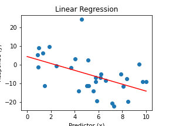
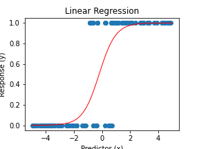
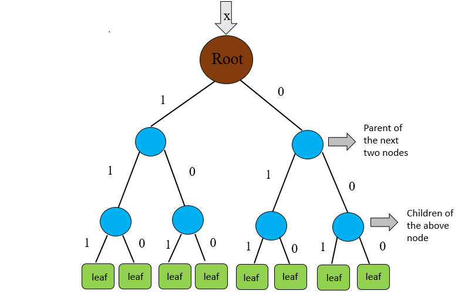
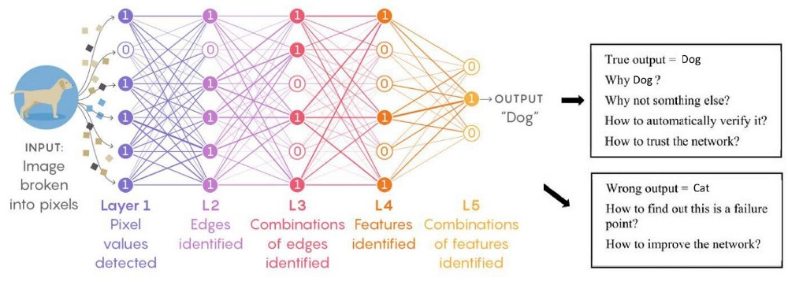
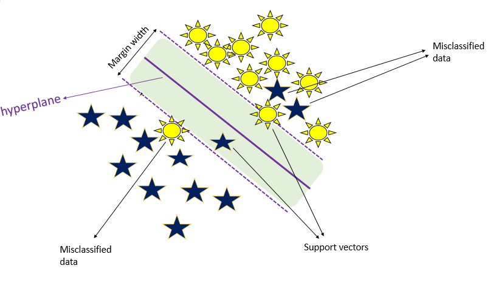
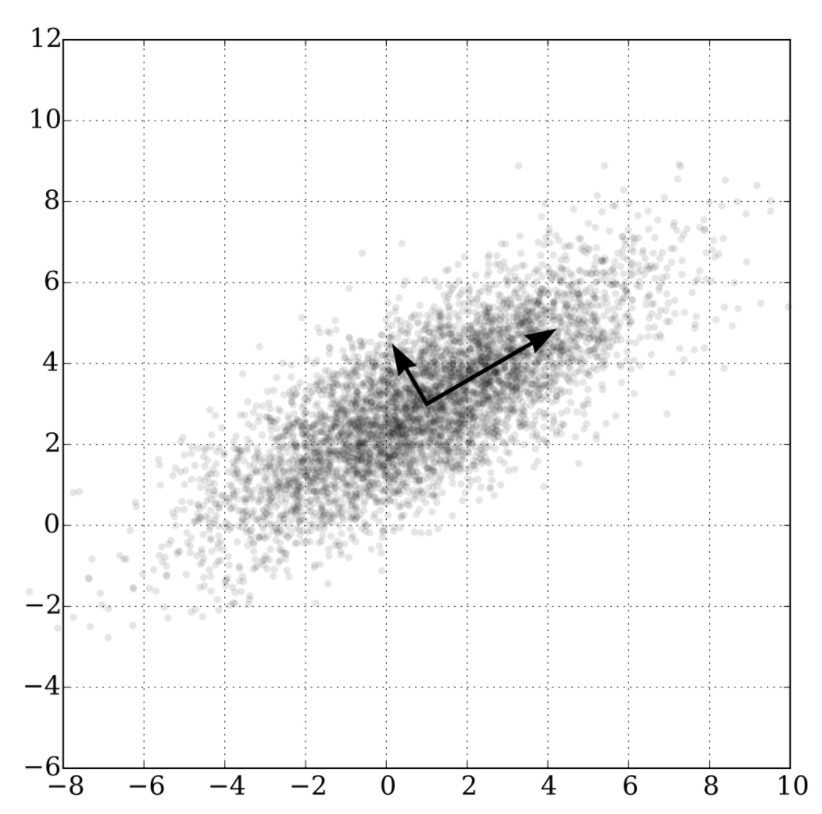

# Learning Outcomes

- [ ] Define supervised and unsupervised models. 
- [ ] Define classfication and regression. 
- [ ] Introduce some popular algorithms.

# What is a Model?

You make models everyday. For example, you:
- Choose the most scenic sidestreets on a walk 
- Try to find the fastest lane on the highway 
- Make small changes to improve how your coffee tastes

By doing the same things over and over again, you learn about the system——how other drivers behave or the flavours of different brands of coffee beans——and you learn to adjust your behaviour in order to optimize a result. 

**This is what a model does.** The data is what happened in the past and the model is the equation that tells us how to optimize the result. 

# A Tour of Models 

There are loads of different types of models: linear models, logistic models, optimization models, network models, and more.  

In the following slides, we will take you on a tour of some of the most common DS and ML models. 

Don't worry — you don't need to know all of these! In fact, very few people have mastered *all* models. 

Rather, the objective is to know what models exist, so you may choose the most appropriate ones for your own data. 
We just want you to get a sense of what's available. 

# Supervised and Unsupervised Algorithms

Watch this vidoe! :)

Machine learning algorithms can be categorized to two major categories: supervised models and unsupervised models. In the supervised approach, during the training the algorithm is trying to learn a mapping function between the input features (variables) and target values (labels). In other words, we know the right answer (label) and we make the model try to guess the answer based on the information we provide.

Unsupervised learning is an approach in which labels are not provided (unknown target values) and the algorithm tells us what it sees. For example, a classification algorithm might try and find a line such that (almost) all of the values on one side are similar to each other but different from the values on the other side. We still have to tell the model how to define similarity, but the model finds out where to find the line.

# Regression and Classification

Both Regression and classification are categorized under the same umbrella of supervised machine learning. In regression, the output is numerical (or continuous) while in classification the output is categorical (or discrete). 

Regression Example:
- Estimating the price of a house based on its neigbourhood, tax rates and number of rooms.  
- Estimating the ozone level based on temperature, altitude, latitude and longtitude of the location of estimation.
 
Classification Example:
- Predicting the probabilty of death from heart disease based on paitents' age, gender, blood pressure, and blood cholesterol level (paitent either survives or not)
- Predicting if an Amazon Prime User will unsubscribe their membership based on number of their visit, their location, and the number of times they returned a product. 

Source of Figure: https://www.javatpoint.com/regression-vs-classification-in-machine-learning 

## Examples of Supervised Learning 

## Linear Regression

A linear regression look for the 'line of best fit' for the data (see the example above), and assume that there's a linear relationship between the x and y variables. 
- These models can be used for both inference and prediction.
- The best variables for linear models are continuous but discrete and categorical predictors can be used, too.

## Logistic Regression

We use logistic regression for **classification** tasks when the target variale is binary. 

We use a logistic function (the S curve shown above) to try to best fit the data. The S can be stretched/moved/flipped as necessary.

## Decision Trees

In a decision tree, a tree-like model of decisions (choices of variables) and their possible outcomes is displayed. Decision trees are used for both regression and classification tasks. More on this algorithm can be found in Unit 4 (lesson 3).

## Neural Networks

Neural networks are set up to imitate neurons in the brain. We use the predicted probability of a logistic regression to imitate how neurons in the brain fire, or make decisions. More on this topic is presented in Unit 5 (lesson 2). Neural Networks are used for classfication and regression. 

Source: https://medium.com/analytics-vidhya/deep-learning-visualization-and-interpretation-of-neural-networks-2f3f82f501c5

## Support Vector Machine (SVM)
SVM used for classification tasks. The algorithm finds the separation (between classes) with the largest 'margin', which is shown in the figure below. The SVM algorithms can successfully handle small training sets, while producing highly accurate predictions. Moreover, the algorithm is suitable for datasets with unknown distributions.

## Examples of Unsupervised Learning 

## Principle Components Analsysis (PCA)
    - PCA is a method to reduce the dimensionality of data (for example, to reduce 10 variables down to 2).
    - PCA is a **linear** dimension reduction method seeking to maximize varaiance (informal description: things that are different will end up far apart while similar things end up close to each other). 

    

## t-Distributed Stochastic Neighbor Embedding (t-SNE) 
- t-Distributed Stochastic Neighbor Embedding (t-SNE) is another examaple of an unsupervised algortihm. The algortihm can be very useful in visualizing high-dimensional data. Unlike PCA, the algorithm is non-linear, thus is a perfect choice for data with non-linear structures. 

- In the t_SNE two main steps are takes: First, a probabiloty distribution over pairs of high-dimensional objects is constructed such that similar objects are assigned higher probability (dissimilar objects have lower probability). Second, a similar probabbility distribution in the low-dimensional map is calculated. And, the Kullback–Leibler divergence between the two distibutions is minimized.   

## K-Mean clustering 

- K-means is a non parametric unsupervised model (no labels are provided). The goal in K-means is to organize data such that similar data belongs to the same cluster. A cluster contains a set of data points, data within each cluster are similar to each other and are dissimilar to data points from other clusters. More on K-mean is provides in Unit 5 lesson 1. 

# Summary

- [x] We introduced the broad range of models used in ML.
- [x] We defined supervised and unsupervised models. 

In particular: 
- We showed that dimension redction techniques can be really handy when dealing with high dimension data
- We realized that clustering techniques can give us good insights about our data and sometimes can be used to visualize the data.  

**Deciding which model is the best for a specific set of dataset is a skill which comes up with the combination of experience and knowing the foundation of each model.**

For even more (with Python code), see [this link.](https://scikit-learn.org/stable/tutorial/machine_learning_map/)

 

# See you in Unit Two!

