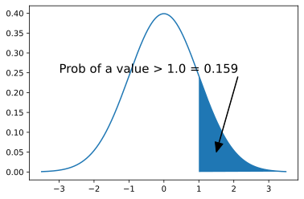
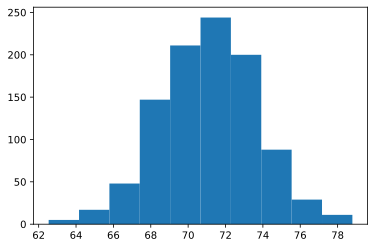
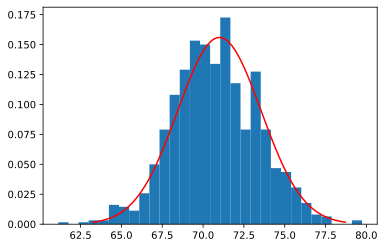

# Centeral Limit Theorem (Optional)

According to the centeral limit theorem (CLT): the sample means of a given dataset, as the size of the sample increases, will approximate the normal distibution. 

**Note**: 
- The samples should be suffciently large in size.
- The data should be sampled randomly.
- Samples should be independent from each other. 

There is one important thing that we *don't* need here: any assumptions about what the population looks like! This is what makes the CLT so powerful (almost mystical). It is unreasonable how many times somethin in statistics end up being normal, even though we started somewhere else. We'll try to keep the details to a minimum and just show the extreme case.

# Learning Outcomes

1. Understand the general idea of the normal distribution.
2. Recognize when the CLT applies.
3. Appreciate the importance of this theorem.

Things you don't need to remember:

1. How to calculate normal probabilities.
2. How to make all of the plots.

# Normal Distribution

Basically, the normal distribution tells us the probability of being a given distance away from the mean. It's more likely that values are close to the mean, and less likely that they're further away. 


```python
import numpy as np
import scipy.stats as stats
import matplotlib.pyplot as plt

# Set a grid of x values
x = np.arange(-3.5, 3.5, 0.01)
# Calculate the y-values of the normal distribution
y = stats.norm.pdf(x)

# Fill in a polygon
xupper = np.arange(1, x.max(), 0.01)
yupper = stats.norm.pdf(xupper)
# add the lower left point of the polygon
xupper = np.append(xupper, xupper[0])
yupper = np.append(yupper, 0)

# Calculate the probability in the upper tail
upperperc = 1 - stats.norm.cdf(xupper[0])

# Put it all together in a plot
plt.plot(x, y)
plt.fill(xupper, yupper) # add a polygon (shaded region)
plt.annotate(xy = [1.5, 0.05], xytext = [-3, 0.25], size = 15,
    text = "Prob of a value > " + str(xupper[0]) + " = " + 
        str(np.round(upperperc, 3)),
    arrowprops = dict(color = "black", width = 0.5, headwidth = 10))
plt.show()
```





The normal distribution is entirely defined by it's **mean** and **standard deviation** (which is the square root of the **variance**). If you know these two values, then you know everything about that normal distribution.

In the following code block, change the mean and sd and see what happens!


```python
mean = 1 # try values between -10 and 10
sd = 0.5 # try values between 0.001 and 10

x = np.arange(-10, 10, 0.05)
y = stats.norm.pdf(x, loc = mean, scale = sd)

plt.plot(x, y)
plt.ylim(0) # y limits always include 0
plt.show()
```


There are lots of things to know about the normal distribution, but for now it's enough to say the following:

- It describes the probability of getting random values above or below a given number.
    - Values close to the mean are more likely.
- If you know the mean and sd, then you know the whole distribution.

For example, suppose student grades follow a normal distribution with a mean of 71 and standard deviation of 10. If you were to pick a student at random from the course, the probability that they have a grade above 80?

This can be found using the Cumulative Distribution Function, which gives the area under the curve to the left of a given value. If we want the probability above a given value, we simply do 1 minus the probability that it's lower than a given value.


```python
1 - stats.norm.cdf(80, loc = 71, scale = 10)
```


    0.18406012534675953


So there's a 18.4% chance that a randomly chosen student has a grade above 80 if the mean is 71 and the sd is 10.

The actual calculation here is not important - I just want you to know that the normal distribution tells us about probabilities.

# Many samples, many means

Let's continue with the student example (mean = 71, sd = 10, and for now we'll say that there are a lot of students). If we were to take a random sample of 15 students, we'll get something slightly different from 71. Let's try that now:


```python
sample_1 = np.random.normal(size = 15, loc = 71, scale = 10)
print(sample_1)
print("") # Empty line for extra space in the output
print("The mean of the sample is: ", np.mean(sample_1))
```

    [57.2052932  47.08726889 76.03616914 67.10041732 56.91204771 77.86288506
     66.36800298 69.30928217 72.01614255 58.57054067 70.74175863 65.51814051
     71.90775421 74.2364235  53.89686257]
    
    The mean of the sample is:  65.65126594025371


Go ahead and run that code chunk as many times as you like. Each time, we get a different mean.

With some clever coding, we can make python run this hundreds of times for us:


```python
samples = np.array([]) # Start with an empty array

for i in range(1000):
    sample_i = np.random.normal(size = 15, loc = 71, scale = 10)
    samples = np.append(samples, np.mean(sample_i))

plt.hist(samples)
plt.show()
```





Each value in the histogram is a mean of a different sample. This is an important shift in philosophy. Instead of observing 15 grades within each sample, we're treating each sample as if it's *one* observation of a sample mean. Instead of a collection of students, there's a whole bunch of possible samples out there, each one representing a single mean. 

This is called the **Sampling Distribution of the Sample Mean**. Each sample gives a different mean, and we can draw the distribution of all these different means. We've gone up a level here - from data to statistics!

Take a moment to think about that. Instead of samples of size 15, each sample just gives us one number. There will be different samples that have the same people in them, but will give different numbers. It's a big concept to wrap your head around.

# Sampling Distribution of the Sample Mean

If the population (all possible students) is normal with a mean of $\mu$ and a standard deviation of $\sigma$, then the sampling distribution of the sample mean for samples of size $n$ is also normal with a mean of 71, but the standard deviation is $\sigma/\sqrt{n}$.

The only difference is the standard deviation, which ends up being *smaller*. Why is this? Well, consider samples of size 2 in our student example. It's unlikely that we'll get one student above a 90%, but it's much less likely that both students in the sample would be above 90. It's not quite the same with the mean of the two students' grades, but the same logic applies - it's more likely that one value will be extreme than that a mean will be extreme. That's why the variance of the sampling distribution is smaller. 

In the extreme example, think of sampling the entire population. If you're sampling everyone every time, then the mean will always be exactly equal to the population mean - the variance will be 0!


```python
# Draw the sampling distribution
xseq = np.arange(71 - 3*10/np.sqrt(15), 71 + 3*10/np.sqrt(15), 0.5)
# Notice that the sd is the original sd divided by sqrt of n
yseq = stats.norm.pdf(x = xseq, loc = 71, scale = 10/np.sqrt(15))
plt.hist(samples, density=True)
plt.plot(xseq, yseq, color = "red")
plt.plot()
plt.title("The Sampling Distribution of the Sample Mean")
plt.show()
```


# And Now the Magic

It impresses nobody that a normal distribution gives rise to another normal distribution. It's also completely unrealistic to assume that every possible grade could be sampled and there's a near-infinite amount of students. 

So let's do some magic. Let's make this realistic. I'm going to create a population that is NOT normal, but has a mean of 71 and an sd of 10 (by trial and error, so the numbers will be approximate).


```python
grade_pop = np.array([85, 83, 71, 65, 72, 72, 70, 68, 87, 56, 
    91, 65, 67, 49, 51, 71, 75, 76, 72, 78, 74, 71, 69, 62, 64, 
    63, 59, 88, 82, 81, 83, 87, 88, 56, 88, 60, 77, 76, 70, 69, 
    71, 71, 72, 73, 67, 65, 70, 70, 69, 70, 68, 67, 70, 58, 60, 
    55, 51, 89, 73, 71, 80, 90, 60, 61, 67, 68, 71, 72, 81, 80, 
    71, 72, 70, 67, 75, 73, 52, 59, 81, 90, 48, 75, 77, 75])

print("Population mean = ", np.mean(grade_pop))
print("Population sd = ", np.sqrt(np.var(grade_pop)))

plt.hist(grade_pop, bins=25)
plt.title("True population distribution")
plt.show()
```

    Population mean =  71.02380952380952
    Population sd =  9.989251593202077


So should we take random samples from this population? Well, no, that's not what a sampling distribution is. Imagine the means from all possible samples of size 15 from this population - *that's* what we're sampling from! Again, takes a little to get your head around, so stare at a wall for a second and make sure you understand that. Maybe try explaining it to a rubber duck.

So let's get a sample of sample means:


```python
# One sample of size 15
random_indices = np.random.randint(low = 0, 
    high = grade_pop.size - 1, size = 15)

print(grade_pop[random_indices])
print("")
print("Mean of random sample: ", np.mean(grade_pop[random_indices]))

```

    [69 83 62 65 63 56 85 72 82 70 58 68 58 69 68]
    
    Mean of random sample:  68.53333333333333


```python
sample_size = 15
samples = np.array([])

for i in range(1000):
    sampled_mean = np.mean(grade_pop[np.random.randint(low = 0, 
        high = grade_pop.size - 1, 
        size = sample_size)])
    samples = np.append(samples, sampled_mean)

# Add a normal distribution with the same mean and
# sd divided by square root of the sample size
xseq = np.arange(71 - 3*10/np.sqrt(sample_size), 
    71 + 3*10/np.sqrt(sample_size), 0.05)
yseq = stats.norm.pdf(xseq, loc = np.mean(grade_pop), 
    scale = np.sqrt(np.var(grade_pop)/sample_size))

plt.hist(samples, density=True, bins = 30)
plt.plot(xseq, yseq, color = "red")
plt.show()
```





It's not perfect, but it's unreasonably close. The population is not, in any way, normal. Like, at all. It's not even continuous! But when we take many samples, the means will come from a normal distribution.

# Now let's flip it

Okay, but we're not taking multiple samples - we're taking one. Just one. How does this help us?

When we get a sample from the population, we can find both the mean and sd from that sample. The mean that we get is a good approximation to the population mean, and the sample sd is a good approximation to the population sd. 


```python
means = np.array([])
sds = np.array([])

for i in range(1000):
    new_sample = grade_pop[np.random.randint(low = 0, 
        high = grade_pop.size - 1, 
        size = 15)]
    means = np.append(means, np.mean(new_sample))
    sds = np.append(sds, np.sqrt(np.var(new_sample)))

plt.subplot(1, 2, 1)
plt.hist(means)
plt.title("Distribution of Means")
# Add a red line for the true population mean
plt.axvline(x = np.mean(grade_pop), color = "red")

plt.subplot(1, 2, 2)
plt.hist(sds)
plt.title("Distribution of SDs")
# Add a red line for the true population sd
plt.axvline(x = np.sqrt(np.var(grade_pop)), color = "red")

plt.show()
```


In the plot above, I put a red line for the true values. As you can see, the estimates from the samples are generally pretty close to the true value.

**This is why inference works.** With a large enough sample size, means become normal. If you learn more stats, you'll find that most things are basically means. Basically, no data are actually normal but the statistics that we calculate become normal with a large sample. 

# Summary

1. If you take repeated samples, you'll get a distribution of sample statistics.
2. Big sample size means that the distribution of a mean (NOT the data) is normal.
    - The variance of the distribution of means is smaller than the variance of a sample.
3. Many things end up looking like means, so normal distributions appear everywhere.
4. Knowing this, we can use a sample to say something about a population!!!

Note: The sd looks like it kinda follows a normal distribution. Theoretically, it's actually a different distribution (Chi-square), but that distribution also becomes a normal distribution as the sample size increases. Like I said, it's unreasonable how much the normal distribution shows up.
