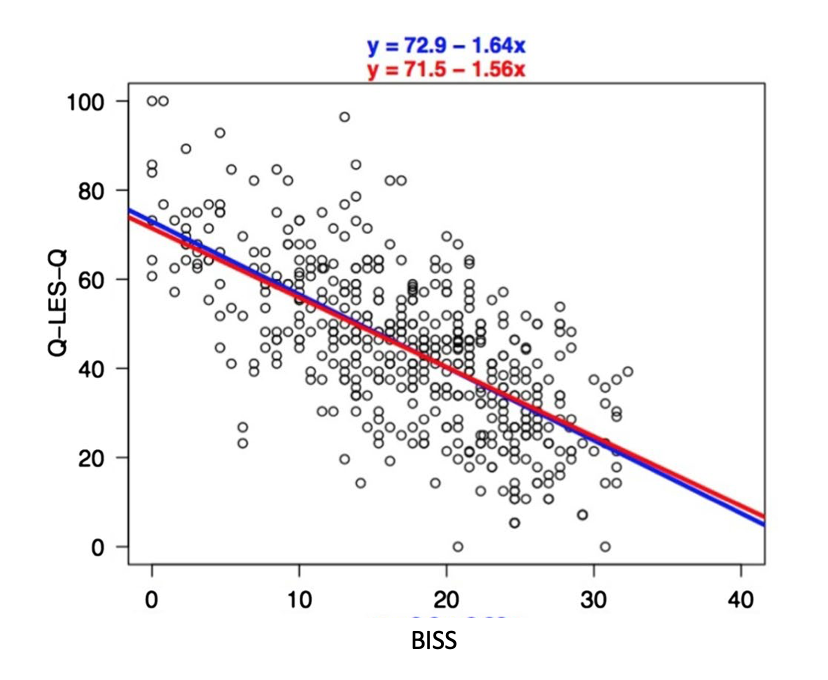
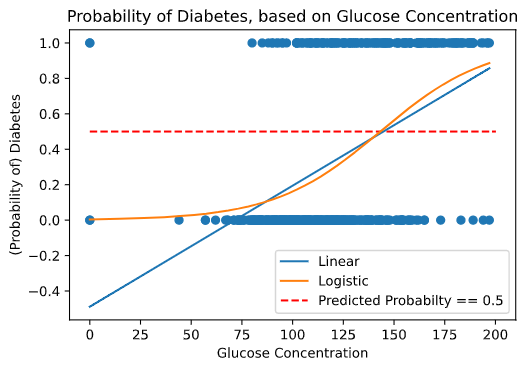

# Learning Outcomes

- [ ] Examine when linear regression is useful in research 
- [ ] Understand why linear regression cannot be matched with a binary target variable

# Linear Regression in Action 

# Case Study: Force Sensitive Resistors 

Force Sensing Resistors (FSRs) are used to measure the amount of force. For example, we use them inside car seats. 

When a person sits in a car, the FSR detects the force exerted to it and the seatbelt sign activates. 
- When a FSR senses force it produces voltage. 
    - As the force becomes larger the output voltage becomes larger too!
    - In fact, there is a linear relation between the amount of force and the produced voltage for these sensors. 
    
In an experiment we need to calibrate our FSRs, meaning we need to find the best fit between different force and output voltage.  

The scattered plot of voltage and force data is shown below, along with the line of best fit (see the linear_regression_example paper which we upload in GitHub). 

Although the calibration is a simple step, it is very important!


# Case study: Poor quality of life and functioning in bipolar disorder

People diagnosed with bipolar disorder typically experience lower quality of life. 
- Sylvia et al. 2017 examined the relation between the severity of bipolar disease and a person's life satisfaction. 

Here we show one of the figures they presented in their paper:



The x-axis of the plot is BISS, which is a clinician-administered interview focusing on assessing bipolar symptoms. Higher BISS = Greater Clinical Symptoms 
- The questionnaire is designed based on a 5-point scale that ranges from "very poor" to "very good". 
    - The BISS scores in this study were re-scaled to range from 0 to 40. 
- The y-axis is the Q-LES-Q that is a self-report assessment quantifying the quality of life. 

The authors concluded that participants with higher BISS (greater clinical symptoms) has lower quiality of life, and the p-value was smaller than 0.001. This allows them to reject the null hypothesis with confidence!

<sup>ref: Sylvia, L. G., R. E. Montana, T. Deckersbach, M. E. Thase, M. Tohen, N. Reilly-Harrington, M. G. McInnis, et al. 2017. “Poor quality of life and functioning in bipolar disorder.” International Journal of Bipolar Disorders 5 (1): 10. doi:10.1186/s40345-017-0078-4. http:// dx.doi.org/10.1186/s40345-017-0078-4.
</sup>

# Case Study: Infant Mortality Rate as an Indicator of Population Health 

The infant mortality rate (IMR) has been used as a measure of population health. 
- It is proposed that more comprehensive measures such as Disability Adjusted Life Expectancy (DALE) could be better alternatives. 
    - However, Reidpath et al. 2003 showed that there is a strong linear realtion between DALE and IMR, such that countries with low DALE have high IMR:


<sup> ref: Reidpath DD, Allotey P Infant mortality rate as an indicator of population health Journal of Epidemiology & Community Health 2003;57:344-346.</sup>

# Binary Target Variables: When Linear Regression Fails!

In the code below, we demonstrate why linear models are not well suited to binary outcomes. 

In this example, we have a dataset that tells us whether a patient has diabetes or not, along with their glucose concentration.

The blue line is a linear model. To make predictions from this, we could do something like "If the height of the line is above 0.5, then we predict the patient has diabetes".
- However, notice how the line isn't actually predicting valid probabilities. 
    - If the patients' glucose concentration was 0, the line predicts a -25% probability of diabetes!!!

In contrast, the logistic regression is shown in orange. The logistic regression results in an "S" shaped curve, called a *sigmoidal function*, that predicts a near 0% chance of diabetes when the glucose concentration is 0. 
- If we're using a simple rule like "if the curve is above 0.5, predict diabetes", then this actually is equivalent to linear regression. 

But logistic regression is a bit more complicated than this. We'll discuss how logistic regression is different and how to use it to make predictions in Unit 4! 

```python
import numpy as np
import matplotlib.pyplot as plt
import pandas as pd
from sklearn.linear_model import LinearRegression
from sklearn.linear_model import LogisticRegression

# Load Data
diab = pd.read_csv("Unit2_Principles/data/diabetes-train.csv")
np.random.seed(2112)
diab = diab.sample(n = 100)

# Prepare features and outcome
X = diab[["glucose_concentration"]]
y = diab["diabetes"]

# Linear Regression
linear_model = LinearRegression().fit(X, y)

# Logistic Regression
logistic_model = LogisticRegression().fit(X, y)

# Predictions on a sequence of values spanning glucose concentration
X_pred = np.linspace(
    start = X["glucose_concentration"].min(), 
    stop = X["glucose_concentration"].max(), 
    num = 200)
X_pred = X_pred.reshape(-1, 1)
linear_pred = linear_model.predict(X_pred)

# For logistic, predict probability that diabetes == 1
logistic_pred = logistic_model.predict_proba(X_pred)
# predict_proba returns a matrix: first column is Prob(diabetes = 0)
# and second is Prob(diabetes = 1). We just need the second column.
# (More on Logistic predictions next week!)
logistic_pred = logistic_pred[:, 1]

plt.scatter(diab["glucose_concentration"], diab["diabetes"])
plt.plot(X_pred, linear_pred, label = "Linear")
plt.plot(X_pred, logistic_pred, label = "Logistic")
plt.hlines(0.5, color = "red", linestyles = "dashed", 
    xmin =0, xmax = 200, label = "Predicted Probabilty == 0.5")
plt.legend()
plt.xlabel("Glucose Concentration")
plt.ylabel("(Probability of) Diabetes")
plt.title("Probability of Diabetes, based on Glucose Concentration")
plt.show()
```



# Unit 3, Lesson 3 Wrap-Up

In this lesson, we 
- [ x ] Narrated various situations when linear regression can be useful in research 
- [ x ] Discussed why linear regression cannot be matched with a binary target variable 

We also introduced the logistic regression model, which we will discuss in greater detail in Unit 4! 

See you there! 


