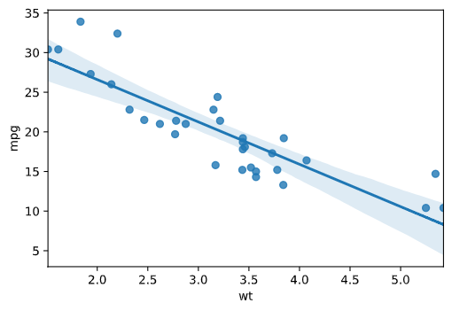
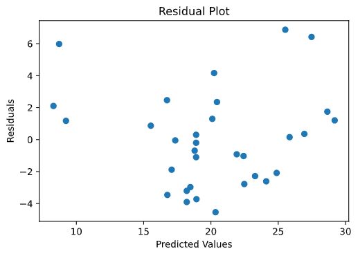
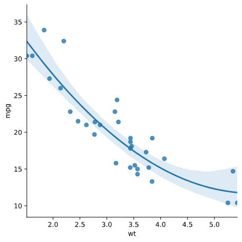

<!---
TODO

- Distributional assumptions (briefly, Devan!)
    - Poisson example
- Shape examples
    - Esp. a gentle sine curve that's hard to notice from scatterplot
- Mechanistic
    - mt cars example, or tree thickness example
- Predictive
    - Polynomial example
- Ethics
    - Does this need a full section at this point?
- Reorder (distributions last)
--->

# Learning Outcomes

- [ ] Understand that models are always going to have "errors", and that inspection of these errors will tell us more about our model and/or data.
- [ ] Visualize and quantify the errors in the model.
- [ ] Recognize the factors that make a model useful.


# How Models Can Be Wrong

Models can be wrong in many ways. They can be:
- Too complex
    - Fits your data very well, but not new data!
- The wrong shape
    - Will show up as patterns in the residual plots
- The wrong mechanistic interpretation
    - Won't necessarily be able to tell this from inspecting the models
    - If it does show up, it will be in the form of unrealistic parameters or unrealistic predictions
- Bad predictions
    - Only way to know is with *cross-validation*, which is covered in the next lesson
- Unethical
    - Be vigilant by avoiding biases in both data collection and analysis 
- Wrong distributional assumptions
    - Will show up as patterns in the residual plots and qqplots

## Models Can Be Too Complex

We'll cover this in the next lesson, but here's the gist: We could always connect the dots on our scatterplot and say that we've fit our data perfectly. But this is not useful. To quote the band The Barenaked Ladies: "Anyone perfect must be lying; anything easy has its cost." 

## Models Can Have the Wrong Shape

There's a classic dataset called Anscombe's Quartet. This data includes four different data sets, each with x values and y values. Let's look at the dataset's summary statistics.

```python
import pandas as pd
import seaborn as sns

anscombe = sns.load_dataset("anscombe")

# Calculate mean and var of both x and y
anscombe.groupby("dataset").mean()
anscombe.groupby("dataset").var()

for i in sorted(set(anscombe["dataset"])):
    anscombe_sub = anscombe[anscombe["dataset"] == i]
    print("Correlation:", anscombe_sub["x"].corr(anscombe_sub["y"]))
```

```
#anscombe.groupby("dataset").mean()
dataset x	    y
I	    9.0	    7.500909
II	    9.0	    7.500909
III	    9.0	    7.500000
IV	    9.0	    7.500909

#anscombe.groupby("dataset").var()
dataset x	    y
	
I	    11.0	4.127269
II	    11.0	4.127629
III	    11.0	4.122620
IV	    11.0	4.123249

# Correlations:
Correlation: 0.81642051634484
Correlation: 0.8162365060002428
Correlation: 0.8162867394895984
Correlation: 0.8165214368885028
```

The summary statistics all seem to be the same! 
Surely, if we fit a linear model to each dataset they'd fit similarly well, right?

```python
import matplotlib.pyplot as plt

# Use col to determine columns of feceting
sns.lmplot(x="x", y="y", col="dataset", data = anscombe)
```


Absolutely not. 

**If it is possible to plot your data then PLOT YOUR DATA.** 
Summary statistics mean nothing if you've never looked at a plot.

## Models Can Have the Wrong Mechanisms

Consider the following data set:

```python
import pandas as pd
import seaborn as sns

mtcars = pd.read_csv("Unit3_Stats/data/mtcars.csv")

sns.regplot(x="wt", y = "mpg", data = mtcars)
```



The linear model fits okay, but not great. At the left end the points are all above the line, in the middle they're mostly below the line, and at the right they're mostly above the line again. This can be seen a little clearer in the residual plot:

```python
from sklearn import linear_model
import numpy as np
import matplotlib.pyplot as plt

X = mtcars["wt"][:, np.newaxis]
y = mtcars["mpg"]

mtlm = linear_model.LinearRegression().fit(X, y)

predicted = mtlm.predict(X)
resids = y - predicted

plt.scatter(predicted, resids)
plt.xlabel("Predicted Values")
plt.ylabel("Residuals")
plt.title("Residual Plot")
plt.show()
```



In many analyses, this wouldn't actually be a dealbreaker for this model. However, we want to be thorough.

What if, instead of a straight line, it was a curve? Using the same tools as linear models, we can fit a polynomial regression. This just fits the parabola of best fit. 

```python
sns.lmplot(x="wt", y = "mpg", data = mtcars, order = 2)
```



It looks really good! Honestly, the line wasn't too bad, but this is still a noticeable improvement!

Let's unpack the model and what it tells us about the relationship between fuel efficiency and weight. 
- Light cars see a drastic loss in fuel efficiency when weight is increased, but this loss is much less pronounced in heavier cars!
    - Why might that be? Probably because larger engines are already going to be heavy, so you might as well give them enough power to deal with a little more weight. 

How do you give cars more power? One method is to add cylinders...


```python
sns.regplot(x = "wt", y = "mpg", hue = "cyl", data = mtcars)
```


Looking at the number of cylinders, we have three different lines, each with fairly similar slopes. It turns out that all cars are affected about the same by increasing weight, but the number of cylinders affects the base fuel efficiency (the intercept).

The lesson here is that more complex models aren't always better. At each step in your analysis, consider whether you're adding more complexity or more information. There is no single "correct" model, but a model that incorporates the right information will give you better insights!

**The best model is created by someone that accurately understands the distribution of their raw data!**

#  Optional Read for Interested Readers

## Distributional Assumptions

When we fit a model, there's almost always a distributional assumption somewhere (even in neural networks). Depending on the model, these can be hard to assess.

For linear models, the assumptions are pretty straightforward: we're assuming that the data were sampled well and that the residuals (errors) follow a normal distribution. 

There are some statistical tests for whether something follows a normal distribution, but these can be deceiving. The best way to assess normality is to look at your data. In particular, the **QQ-plot** is what you seek.

The QQ-plot is set up as follows. Let's say we have data [3,5,5,6,7,8,9]. To construct a QQplot, we need to construct the *quantiles*.
- The *median* is the middle number, which also represents the 50% quantile. 50% of the distribution is below this value. In our data, this number is 6.
- For a normal distribution (with a mean of 0 and an standad deviation of 1), the middle value is 0.

With these two pieces of information, we can start our plot! We put 0 on the x-axis (the 50% quantile of the normal distribution) and 6 on the y axis (the 50% quantile of our data).

Next, let's look at the 25% quartile (also sometimes called Q1).
- We can calculate this from our data using many different rules. One rule is to just take the median of the numbers that are strictly below the median. In this case, that's the median of [3,5,5], which is 5. 
- For a normal distribution, we can get a computer to tell us that the point on the x-axis at which 25% of the normal distribution is below that line is -0.6745.

We can add a second point to our QQ-plot!

The code below creates the QQ-plot for the rest of our data, using a more sophisticated way of saying "the second point is Q1".

```python
import numpy as np
import matplotlib.pyplot as plt
import scipy.stats as stats

x = np.array([3,5,5,6,7,8,9])

# Calculate which quantiles we actually have in the data
# For instance, it makes no sense to say that the first number
# is the 0% quantile. 
# The following rule of thumb comes from R's ppoints function
a = 3 / 8
xquant = (np.arange(x.size) + 1 - a) / (x.size + 1 - 2 * a)

# Using these quantile points, calculate the x-values
# on the normal distribution that lead to the same quantiles
norms = stats.norm.ppf(xquant)

# Plot it!
plt.scatter(norms, x)
plt.title("QQ-plot")
plt.xlabel("Theoretical Quantiles")
plt.ylabel("Observed Quantiles")
plt.show()
```


# Unit 3, Lesson 5 Wrap-Up

In this unit, we discussed ways that models can be *wrong*. In particular, we:

- [ x ] Discussed how models are always going to have "errors", and that inspection of these errors will tell us more about our model and/or data.
- [ x ] Visualized and quantified the errors in the model.
- [ x ] Outlined the factors that make a model useful.

# See you in the next Unit!


