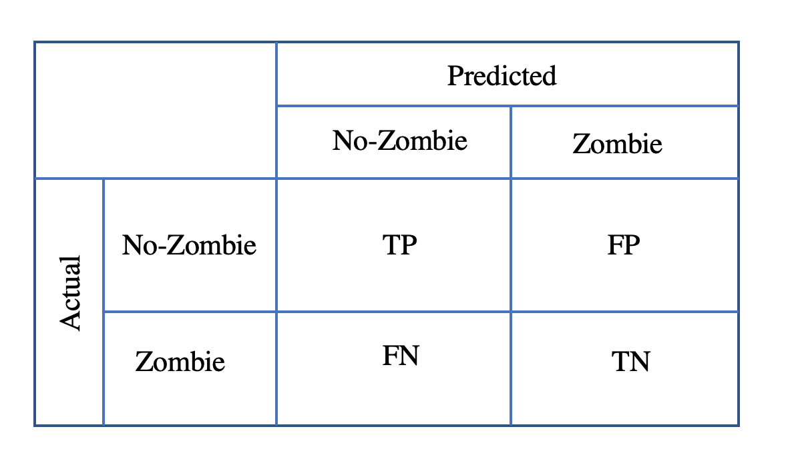

# Learning Outcomes

- [ ] Define and know the difference between parameters and hyperparameters 
- [ ] Understand the output of basic regression and classification models (e.g., errors) and how this can reveal salient features of the models
- [ ] Recognize the variety of visualizations that can be used for these outputs
- [ ] Understand what the models can say about data based on the visualizations

# Model Outputs

In this lesson, we discuss the intended outputs of a model. 

These include: 
- Predictions and Prediction Errors
- Model Parameters and Hyperparameters
- Feature Importance

## Model Output: Predictions and Prediction Errors

After training an algorithm using the training dataset (historical data), we can apply that algorithm to a new set of data. The output from the algorithm is called a **Prediction**.

A **Prediction Error** refers to the difference between prediction (the estimated output of the model) and the true value (the actual label). 
- The goal is to minimize the prediction error.
- The smaller the error, the better! 
- In regression (recall, this is generally the 'line of best fit'), the prediction error identifies how well the algorithm predicts a continuous response/ target/ dependent variable. 
- In classification, we have a categorical response variable and the prediction error measures if new datasets are correctly classified to their category.

# Model Output: Model Parameters

Typically, in the **training phase** the goal is to minimize a measure of prediction error for the training samples. A model parameter is part of the model that can be estimated/ learned from the data (training data). Estimation of model parameters is done using an optimization algorithm (an optimization is a procedure with the purpose of finding the best/optimum solution). 

For example, consider a simple case in which a kid who sells lemonades during summer, has realized that in hotter days of summer his sale has boosted, he hypothesized that the relation between the temperature and lemonade sale is linear (the kid is a genius). The objective is to find the best line to fit the data. The regression line is then used to predict the sale price for unseen values of temperature. As, the model is linear the slope and intercept are parameters which are needed to be estimated; thus are model parameters. 

In the linear regression, by minimizing the sum of squared residuals (difference between the prediction and the actual value); best model parameters are calculated. As is shown in the figure below the green line is the prediction (output) and the blue points are the actual data.

Figure is taken from: https://www.dataquest.io/blog/understanding-regression-error-metrics/.

----------------

# How good is a model; case study for regression (The lemonade stand): 

After the training phase, one should examine how well the trained model can predict unseen data (test data). Plotting the residual can be insightful. In the lemonade stand example, by fitting a linear regression to the data the lemonade stand kid sees a good match between the line and data! But, how good the match is? Visualizing the residual plot can shed some light: 

Here as shown in the figure, the residuals (the actual value minus the value expected by the line) show symmetric characteristic around the x axis (no outlier, or skewness toward some part of data is seen). Moreover, the residual values are between -1 and 1 which is promising (the smaller the value the better!). Lastly, the plot indicates no specific pattern.  

This barely scratches the surface of residual plots for linear models. There are specific plots to show deviations from modelling assumptions, deviations from the structure of the model, quality of predictions within the data, quality of predictions on data that weren't used to fit the model, etc. We'll cover more of these next week. For now, we just want to demonstrate that the best way to evaluate a model is to check where it fails.

# How good is a model: case study for classification (The zombie outbreak):

To test the performance of a classification model, a matrix (called confusion matrix) that contains information about the actual and predicted claassification is commenly used. For example, consider in response to a zombie outbreak event, we have designed a test which can classify people as zombies and non-zombies before the zombie group show any symptoms. We would like our test be precise to be able to safely seperate the zombie group from the healthy ones. A plot of confusion matrix is a fast visulization of the overall performance of our test:

As shown in the above plot, diagonal elements of the confusion matrix corresponds to correct classifications (either positive or negative: people who are zombies and are classfied correctly as zombies and people who are not zombies and are classified as non-zombies correctly). The off-diaoganl elements correspond to incorrect classifications (zombies are classified as non-zombies and non-zombies are classfied as zombies). Intutively, one can conclude that in a good classification the summation of the diagonal elements of the matrix is large. This can be shown by defining accuracy. The *accuracy* is defined as the proportion of the total number of predictions that were correct. Here an explanation of some common terms used to interpret classficiation performance is presented: 

- True Positive: Model predicts postive (zombie) and is actually positive (zombie). 
- True Negative: Model predicts negative (non-zombie) and is actually negative (non-zombie).
- False Positive: Model predicts positive (zombie) but is actuallt negative (non-zombie).
- False Negative: Model predicts negative (non-zombie) but is actually positive (zombie).
- Recall: Ratio of True Positive to all positive cases (True positive and False Negative).
- Precision: Ratio of True Positive to all cases which classified as positive (True Positive and False Positive).

# Model Hyperparameters

Models need more parameters that can't be estimated/ learned from the data. Rather we need to **"tune"** these parameters for the optimal result. The tuning process can be a set of trial and errors. Models can have some important hyperparameters. In "Code_KMeansAndHyperparameter.ipynb" notebook we show an example of hyperparameter tuning for Kmean clustering algorithm.

While reading through this notebook, keep in mind that we're demonstrating hyperparameters in general and Kmeans is just an example. Many models have hyperparameters, and these must be tuned according to similar rules. In general, visualizations are the best (and sometimes only) way to know that you've tuned the hyperparameter well.

 

# Feature Importance

In the training phase of a predictive model, different features/variables are used. Some features might be more important/useful to make predictions. Feature importance refers to class of techniques that assign weights to input features so that features that are more critical in prediction have higher weights. As feature importance gives insights about data it plays an important role in dimension reduction tasks as well as feature selection (to build predictive models). Here, we explore feature importance calculations for some algorithms:

### Linear regression/ Logistic regression feature importance 

In linear regression algorithm for each input variable we will calculate/retrive a coefficient. The value of this coefficient can be used as a proxy of how important each variable is.
- This is much more meaningful if the features are all **rescaled** to be on the same scale. This is generally done by **standardization** subtracting the mean and dividing by the standard devation. 

For example, consider a regression of body weight versus flipper length and bill length for a data set containing information on penguins (from the wonderful Allison Horst: https://allisonhorst.github.io/palmerpenguins/). 

The data are available from [Allison's GitHub page](https://allisonhorst.github.io/palmerpenguins/) and we've placed a copy in the `data` folder on the DSWoT GitHub. If we do a regression of Body Mass (grams) against Flipper Length and Bill Length (both in millimetres), we get the following coefficients (try it yourself!):

| Intercept | Bill Length | Flipper Length |
|---|---|---|
| -5736.897 | 6.047 | 48.145 |

From these outputs (assuming the model assumptions are satisfied), are we to conclude that the flipper length has about an 8 times larger effect on the body mass than bill length? After all, these results are saying that a 1mm increase in flipper length corresponds to a 48 gram increase in bodyweight, whereas a 1 mm increase in bill length corresponds to only 6g of bodyweight.

We can't directly compare the two because they have different scales (even though they're measured in the same units). In this data set, the bill lengths vary between 32.1 to 59.6 mm - a 1 mm increase is 3% of the range of bill lengths. Flipper lengths range between 172 and 231 mm, so a one unit increase is only 1% of the range.

By **standardizing**, both variables are on approximately the same scale (unless there are **outliers**). This scale is measuring how many standard deviations away from the mean a given value is; a standardized value of -2 is two of the original variable's standard deviations below the mean of the original variable (take a moment to think that through). After standardizing, the new parameters are:

| Intercept | Bill Length | Flipper Length |
|---|---|---|
| 4201.75 | 33.02 | 677.00 |

Now we see that a increasing the flipper length by one of it's standard deviations has a *20 times* larger effect than increasing the bill length by one of its standard deviations. This gives us a sense of how much a variable affects the results while taking into account the range of that variable. 

The intercept is not informative for feature importance, but a bar plot of the coefficients will give us a nice visualization of the feature importance!

For more information, see [this tutorial](https://machinelearningmastery.com/calculate-feature-importance-with-python/) (optional).

### Decision Trees Feature Importance 

In decision tree algorithms the importance score for variables can be found based on how much the performance is improved at each split point.

For example, consider predicting extubation failure for patients in an intensive care unit. Suppose we have the patients' blood test results, vital signs, and their demographic information as features. A decision tree might create a split where, if some measure of their blood is above a certain value, it predicts extubation failure. Similarly, it might split at a certain value of their vital signs. The feature importance of these two variables would be how much it changes the predictions. Later in the boot camp, we'll see some more in depth examples.

Feature importance is measured as a single value for each feature, but it's much more informative to view this information graphically. For the extubation example,the plot of feature imporatnce is shown below (the plot is taken from Chen et all, 2019, which can be found in the GitHub repo for Unit 2). There are a total of 68 features, and clearly some are more important. For example, PO2 (pressure of oxygen), Hemoglobin, PaCO2 (artificial partial pressure of oxygen), WBC (while blood cell) and Blood glucose are important features from the blood test result. Moreover, HRmin and DBPmin from vital signs features, and age and weight in demographic information have significance. 

 
 # Unit 4, Lesson 1 Wrap-up 

In this lesson, we:
- [x] Defined and understood the difference between parameters and hyperparameters 
- [x] Learning about the output of basic regression and classification models (e.g., errors) and how this can reveal salient features of the models
- [x] Introduced a the variety of visualizations that can be used for these outputs
- [x] Began to understand what the models can say about data based on the visualizations

 

# See you in Unit 4, Lesson 2! 
