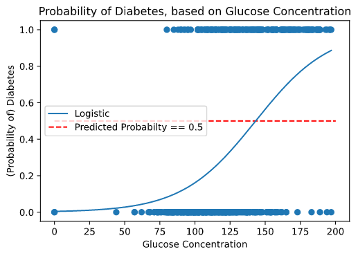
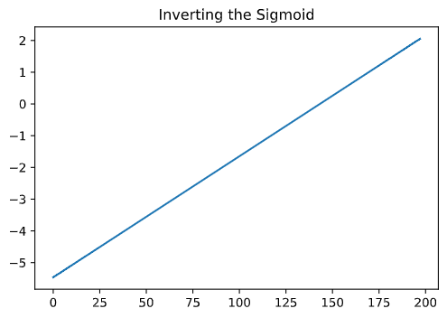

# Learning Outcomes

- [ ] Understand the difference between a regression and a classification model.
- [ ] Know the ideal target variable types for logistic regression.
- [ ] Encounter the probabilistic framework called Maximum Likelihood Estimation and how this connects with logistic regression. 
- [ ] See some ways logistic regression can be used in research.


# Logistic Regression

Thanks to the divide between statistics and data science, logistic regression is actually a classification algorithm. It is built on top of linear models, but transforms the line so that, instead of negative infinity to positive infinity, it goes from 0 to 1. 

Let's say we're predicting the probability of diabetes based on blood glucose levels. 

```py
import numpy as np
import matplotlib.pyplot as plt
import pandas as pd
from sklearn.linear_model import LogisticRegression

# Load Data
diab = pd.read_csv("Unit2_Principles/data/diabetes-train.csv")
np.random.seed(2112)
diab = diab.sample(n = 500)

# Prepare features and outcome
X = diab[["glucose_concentration"]]
y = diab["diabetes"]

# Logistic Regression
logistic_model = LogisticRegression().fit(X, y)

# Predictions on a sequence of values spanning glucose concentration
X_pred = np.linspace(
    start = X["glucose_concentration"].min(), 
    stop = X["glucose_concentration"].max(), 
    num = 200)
X_pred = X_pred.reshape(-1, 1)

# For logistic, predict probability that diabetes == 1
logistic_pred = logistic_model.predict_proba(X_pred)
logistic_pred = logistic_pred[:, 1]

plt.scatter(diab["glucose_concentration"], diab["diabetes"])
plt.plot(X_pred, logistic_pred, label = "Logistic")
plt.hlines(0.5, color = "red", linestyles = "dashed", 
    xmin =0, xmax = 200, label = "Predicted Probabilty == 0.5")
plt.xlabel("Glucose Concentration")
plt.ylabel("(Probability of) Diabetes")
plt.title("Probability of Diabetes, based on Glucose Concentration")
plt.show()
```




In the plot above, the curved line represents the predicted probability. This is called a *sigmoidal function* and is actually just a way to transform a linear model to be constrained it between 0 and 1. Here's proof:

```py
plt.plot(X_pred, np.log(logistic_pred/(1 - logistic_pred)))
plt.title("Inverting the Sigmoid")
plt.show()
```



A logistic model is actually fitting a linear model on the sigmoid scale, with parameters chosen to minimize the distance between the sigmoid curve and the 0s/1s in the target. With this in mind, almost everything you know about linear models - including model selection, polynomial regression, AIC/BIC, etc - also applies to logistic models!!! The same features can be used - whether they're categorical or continuous!

Not everything transfers, though. For instance, the R<sup>2</sup> value doesn't make much sense anymore (none of the points lie on the line) and ordinary least squares doesn't work to fit the models. 

The interpretation of the slope parameters also changes between linear and logistic regression. In linear regression, the slope represented the change in y for every one-unit increase in x. For logistic, the slope parameters are the odds ratio for each one unit increase in x. 

```py
logistic_model.coef_
```

```
array([[0.03814043]])
```

In this case, each one unit increase in blood glucose levels represents a 3.8% increase in the log odds of diabetes.

```py
X24_27 = np.array([24,25,26,27]).reshape(-1,1)
preds = logistic_model.predict_proba(X24_27)[:, 1]
odds0 = preds[0] / (1 - preds[0])
odds1 = preds[1] / (1 - preds[1])
odds2 = preds[2] / (1 - preds[2])
odds3 = preds[3] / (1 - preds[3])

print(logistic_model.coef_)
print(np.log(odds1/odds0))
print(np.log(odds2/odds1))
print(np.log(odds3/odds2))
```

```
[[0.03814043]]
0.038140432637316486
0.03814043263731756
0.038140432637316486
```

The log of the odds ratio increases by a constant for each one unit inverse in x! It's linear! This interpretation makes logistic regression fantastic for any problem involving inference. If you have a good sample, then logistic regression provides a crytal clear view of how the features in your data affect your target. 


# Logistic Regression in the Wild! 

Ex. 1 Will a candidate run for office or not?

Ex. 2 Will a smoker get lung cancer or not? 

Ex. 3 Will a blackjack player draw a certain card or not? 

Ex. 4 Will an applicant be approved for a loan or not? 

# Limitations

- Like linear models, the structure is very rigid. We can squeeze/expand, shift, and flip the sigmoidal curve as much as we want, but we can't change it's fundamental shape. 
    - We cannot use logistic regression for, say, a bathtub-shaped probability function where the probability starts near 1, decreases to 0, then increases to 1 again.
    - However, this rigidity also gives it power if it's the correct structure. For something like a dose-response curve, logisitic regression is by far the best possible model.
- Like linear models, model selection is subjective and requires domain expertise, and even then two researchers would come to two (or more) conclusions about the best model given a set of features. 

# Extensions

## Multinomial Regression

Multinomial regression is a regression technique for categorical data, and this is a straightforward extension of linear regression. 

Suppose you are predicting whether someone's pain level is low, medium, or high, based on a set of features (e.g. severity of injury, amount/type of pain killers, etc.). Logistic regression requires a binary target, so it will *not* work here. However, we can shift our viewpoint a little bit. 

Instead of predicting low/medium/high, we can predict low versus not low with a logistic regression. Once this prediction is known we can split the probability of "not low" into medium and high using logistic regression. 

## Logistic Lasso Regression

Lasso regression, which we covered in model selection, works just fine for logistic regression!

## Neural Networks

We'll cover this in more detail later, but neural networks are set up to imitate neurons in the brain. When an input is received, certain neurons fire more than others, which cause other neurons to fire which cause other neurons to fire which cause... which leads to a decision. Mathematically, "causes a neuron to fire" is calculated as the predicted probability of a logistic regression, where the feature set is how much each of the previous neurons fired.

This is more of a mathematical oddity, though, since the interpretability, feature selection, and inference are all lost in the process.


# Wrap-Up

- [ x ] Understand the difference between a regression and a classification model.
- [ x ] Know the ideal target variable types for logistic regression.
- [ x ] Encounter the probabilistic framework called Maximum Likelihood Estimation and how this connects with logistic regression. 
- [ x ] See some ways logistic regression can be used in research.

# See you in Unit 4, Lesson 3: Decision Trees! 

