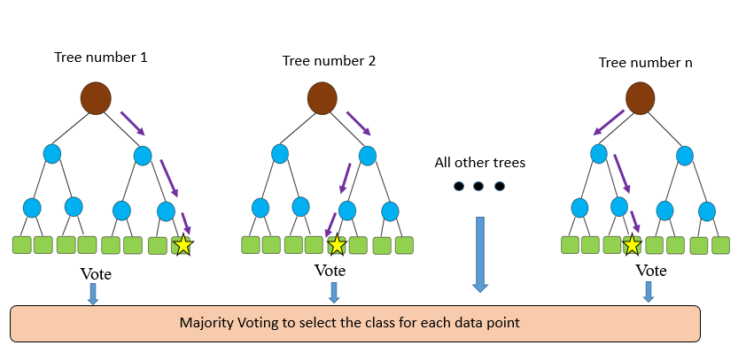

# Lesson OutCome:
- Learn about trees, random forests, gradient decison trees, and XGBOOST.
- Learn when to use each of these methods

## Decison Trees:

- Decision trees are nonparametric algorithms. 
- Decision trees are foundations of some really popular algorithms such as: random forest and boosting methods. 

Lets look at a decision tree:

A decision tree is a set of (binary) decisions represented by an acyclic graph directed outward from a root node to each leaf. There is a root (where all features are allocated) and the root starts branching out (make nodes). In the simpleset version of a tree, each node has one parent and can have two children (answering yes and no questions). a node with no children (meaning that it cannot be divided any more into two parts) is called a leaf. 

To grow a decision tree:
- Make splits: We should answer to a question regarding a selected input feature to split the data in to two groups (forexample: If it is sunny or not).
- Evaluating the splits: At each node, using a score measure, we investigate what is the best feature to select (gives us the most information). The goal is that the leaves be pure (having one of the kind in them)

# Random Forests; when many trees are growing 

Trees are easy to grow, but they can get complex easily and they can easily overfit. We can grow an ensemble of trees and we call it the random forest (RF).
- When the number of trees is large the overfitting is not an issue any more! 
- Each tree votes and the mejority wins (will be the output of the algorithm). 
- In RFs we care about number of trees and depth of each tree (these are some important hyperparameters to be tuned). 
- To grow each tree: the bootstrap aggregating (bagging) method is used to sample from the training set. 

# Gradient Boosting Tree Methods

The idea behind boosting methods: If many "week" models (learning algorithms that are a bit more accurate than 50%) combine together, they eventually boost the predictive performance. In the gradient boosting method, simple (base) models are *sequentially* fitted to the current residual (the difference between the true value and predicted value which we are trying to minimize) at each iteration. Thus, each successive tree is grown based on the prediction residual of the provious tree with the goal of reducing the new residual. Compared to the RF model (that is based on growing multiple independent trees), the gradient boosting method is based on building sequential models. 

 

# XGBoost

XGBoost (eXtreme Gradient Boosting) is an implementation of gradient decision trees whith the goal of providing high speed and performance. Thus, there is an engineering goal in XGBoost to push the limit of computation resources for boosted tree algorithms. XGBoost is implemented as a software library that can be accessed through different programming langugaes (including Python, R, Julia and ...). 

A complete guide on this topic can be found in this nice talk: 

https://www.youtube.com/watch?v=Vly8xGnNiWs

# Summary

In this lesson:
- We talked about decison trees and their limitations which led into introducing Random Forest and Gradient Decision Trees.
- We discussed majour differences between Random Forests and Gradient Decision Trees.
- We introduced the popular XGBoost.  
